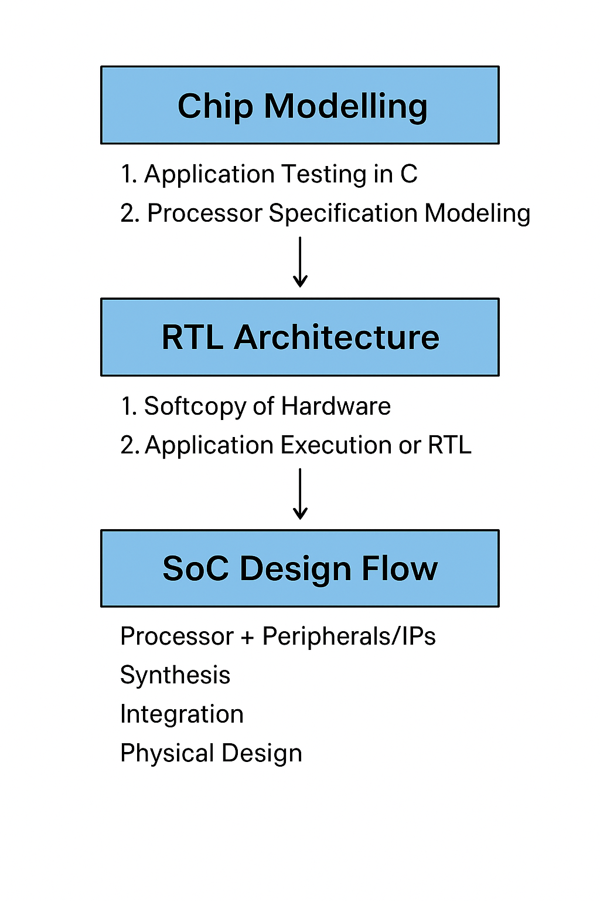

# 🏗️ Task 1 – Getting Started with Digital VLSI SoC Design and Planning

In this task, we explore the **fundamental flow of Digital VLSI SoC design**, beginning with chip modeling, moving through RTL design, and finally reaching SoC integration and physical design.  

The goal is to understand how an **application written in C** can be systematically mapped onto hardware, verified at different stages, and implemented into silicon.

---

## 🔹 1. Chip Modelling

Chip modeling provides the foundation of SoC design by capturing the **functional specifications** in C language before moving into hardware.

1. **Application Testing in C**
   - Write the application in **C language**.
   - Compile using **GCC**.
   - Measure the application output → `O0`.

2. **Processor Specification Modeling**
   - The processor we aim to build is modeled in **C (C-model)**.
   - The same application is tested against this C-model.
   - Measure the output → `O1`.

✅ Verification: Ensure that `O0 == O1`.  
This confirms the **C model** correctly represents the application’s intended functionality.

---

## 🔹 2. RTL Architecture

Once the specifications are validated at the C-model level, the design is described in **RTL (Register Transfer Level)** using a hardware description language (e.g., **Verilog**).

1. **Softcopy of Hardware**
   - Develop an RTL description of the processor and system architecture.

2. **Application Execution on RTL**
   - Run the same application on the RTL hardware description.
   - Measure the output → `O2`.

✅ Verification: Ensure that `O1 == O2`.  
This validates that the RTL description faithfully implements the processor’s specifications.

---

## 🔹 3. SoC Design Flow

With a verified RTL, the design moves into the **SoC implementation stage**:

- **Processor + Peripherals/IPs**
  - RTL integrates processor, peripherals, and external IPs.
- **Synthesis**
  - Generate **Gate-Level Netlist** from RTL.
- **Integration**
  - Combine macros, analog IPs, and synthesized RTL into a unified SoC.
- **Physical Design**
  - Floorplanning, placement, clock tree synthesis (CTS), and routing.
- **Verification**
  - DRC/LVS checks ensure design correctness.
- **Tapeout**
  - Final GDSII sent to fabrication for chip manufacturing.

---

## 🖼️ Design Flow Diagram

Below is the overall **Digital VLSI SoC Design and Planning flow**:

  

---

## 📌 Key Verification Points
- **O0 vs O1** → Ensures that the C model matches the intended application behavior.  
- **O1 vs O2** → Ensures that RTL faithfully implements the specifications.  
- **RTL to GDSII flow** → Ensures that the design is manufacturable and meets physical requirements.
- **O1=O2=O3=O4** → Ensures that the design of chip perfect

---

## ✅ Outcome
By completing this task, we establish the **design methodology pipeline**:  
C-model → RTL → SoC Integration → Physical Design → GDSII.  

This structured flow provides confidence that what we design in **software** can be reliably transformed into **working silicon**.
