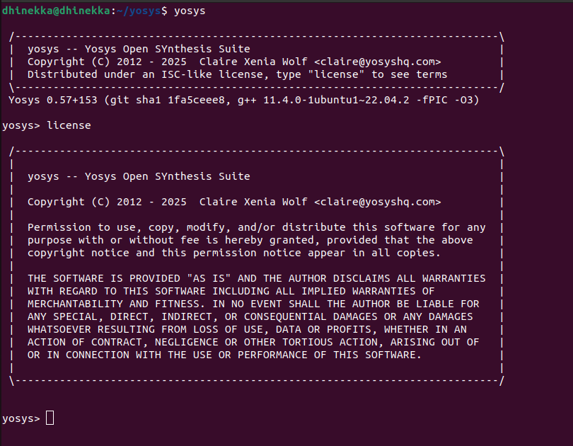
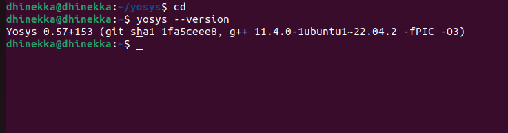
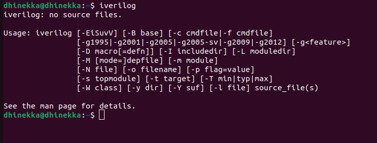
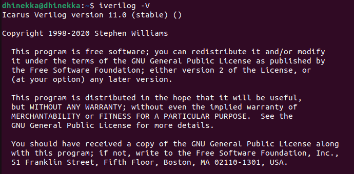
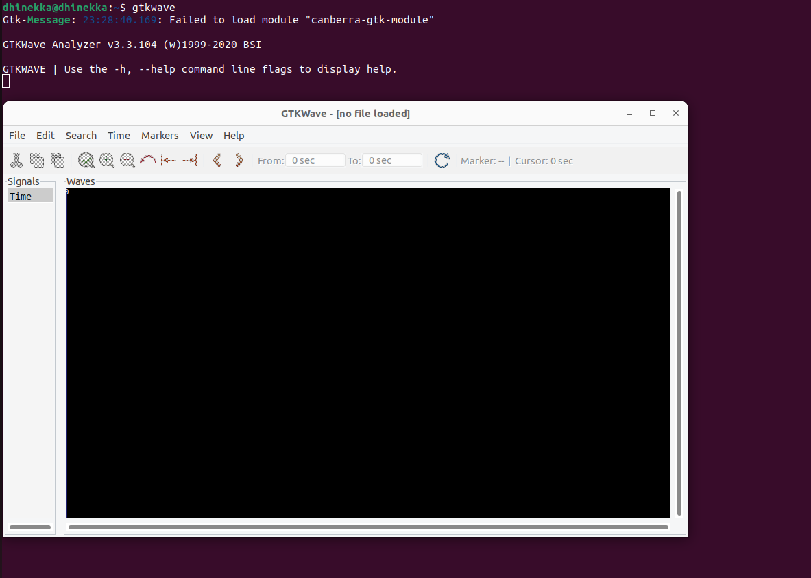
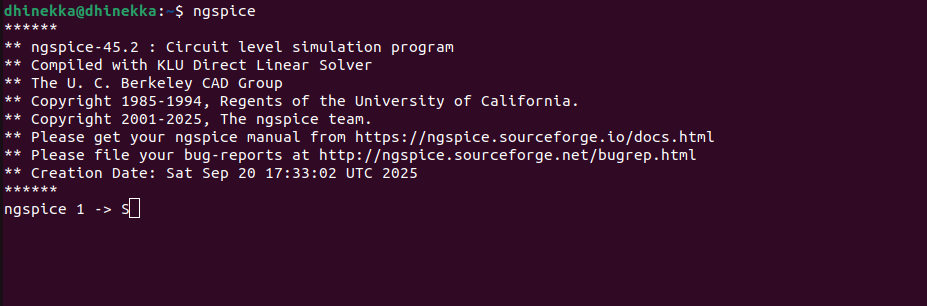
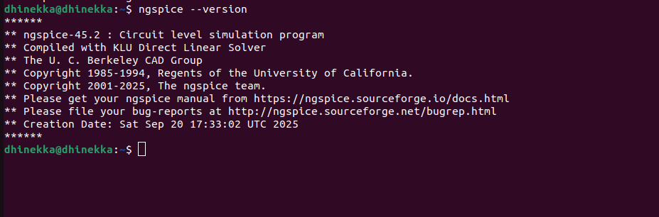
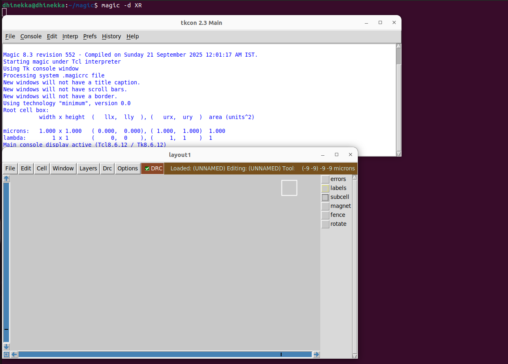
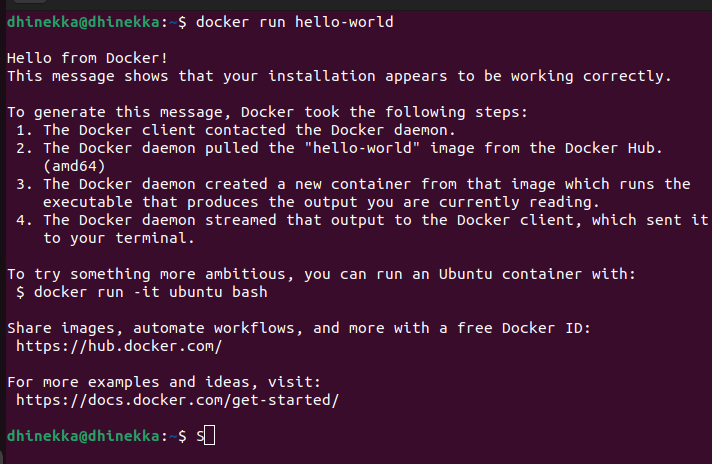
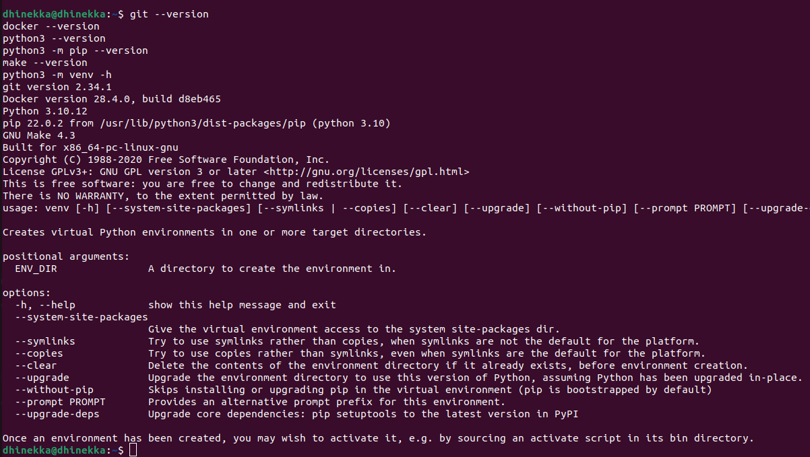

# 🛠️ Task 2 – Tool Installation & Setup

## 📌 Objective
The goal of **Task-2** is to install all the required EDA tools for the **RISC-V SoC Tapeout Program** using the recommended machine configuration.  
Each installation step will be documented here with commands, verification, and snapshots.  

---

## 💻 System Configuration
Before starting, ensure your system meets the following requirements:

- **OS**: Ubuntu 20.04+  
- **RAM**: ≥ 6 GB  
- **Storage**: ≥ 50 GB HDD/SSD  
- **CPU**: 4 vCPUs  

✅ *Note: I am using Ubuntu directly on my laptop (no Oracle VirtualBox).*  

---

## 🔧 Installed Tools

### 1. Yosys – Logic Synthesis
Yosys is an open-source framework for RTL synthesis.  

**Installation Steps:**
```bash
sudo apt-get update
git clone https://github.com/YosysHQ/yosys.git
cd yosys
sudo apt install make -y     # if not already installed
sudo apt-get install build-essential clang bison flex \
libreadline-dev gawk tcl-dev libffi-dev git \
graphviz xdot pkg-config python3 libboost-system-dev \
libboost-python-dev libboost-filesystem-dev zlib1g-dev -y

make config-gcc
make -j$(nproc)
sudo make install
```

<p align="center">
  
</p>

✅ Successfully Installed

---
### ✅ Verification

Run the following command to check installation:

```bash
yosys --version
```

<p align="center">
  
</p>

✅ Successfully Verified

---
### 2. Icarus Verilog (iverilog) — RTL Simulation

Lightweight Verilog simulator.
**Install**

```bash
sudo apt-get update
sudo apt-get install iverilog -y
```

<p align="center">
  
</p>

✅ Successfully Installed

---
**Verify**

```bash
iverilog -V
```

<p align="center">
  
</p>

✅ Successfully Verified

---
### 3. GTKWave — Waveform Viewer
Open-source waveform viewer for simulation outputs.

**Install**

```bash
sudo apt-get update
sudo apt install gtkwave -y
```
---
**Verify**

```bash
sudo apt-get update
sudo apt install gtkwave -y
```

<p align="center">
  
</p>

---
### 4. Ngspice — Circuit Simulator
Analog circuit simulator.

***Install***

```bash
# Download tarball (example: update version if newer)
wget https://sourceforge.net/projects/ngspice/files/ngspice-37.tar.gz
tar -zxvf ngspice-37.tar.gz
cd ngspice-37
mkdir release && cd release
../configure --with-x --with-readline=yes --disable-debug
make -j$(nproc)
sudo make install
```
<p align="center">
  
</p>

---
***Verify***

```bash
ngspice -v
```
<p align="center">
  
</p>

---
### 5.Magic VLSI — Layout Tool

Physical layout editor.

***Install***

```bash
sudo apt-get update
sudo apt-get install m4 tcsh csh libx11-dev tcl-dev tk-dev \
  libcairo2-dev mesa-common-dev libglu1-mesa-dev libncurses-dev -y

git clone https://github.com/RTimothyEdwards/magic
cd magic
./configure
make -j$(nproc)
sudo make install
```
---
***Verify***
```bash
magic -d XR
# or check version / help
magic -v
```
<p align="center">
  
</p>

---
### 6.OpenLANE (OpenROAD Flow) — RTL to GDSII

Full RTL to GDSII ASIC flow (Docker-based).

***Install Docker & prerequisites***

```bash
sudo apt-get update
sudo apt-get upgrade -y

sudo apt install -y build-essential python3 python3-venv python3-pip make git
sudo apt install -y apt-transport-https ca-certificates curl software-properties-common gnupg

# Add Docker repository key and source
curl -fsSL https://download.docker.com/linux/ubuntu/gpg | \
  sudo gpg --dearmor -o /usr/share/keyrings/docker-archive-keyring.gpg

echo "deb [arch=amd64 signed-by=/usr/share/keyrings/docker-archive-keyring.gpg] \
  https://download.docker.com/linux/ubuntu $(lsb_release -cs) stable" | \
  sudo tee /etc/apt/sources.list.d/docker.list > /dev/null

sudo apt update
sudo apt install -y docker-ce docker-ce-cli containerd.io

# Test docker
sudo docker run hello-world

# Add your user to docker group (then reboot to apply)
sudo groupadd docker || true
sudo usermod -aG docker $USER
sudo reboot
```

<p align="center">
  
</p>


---
***Post-boot checks***

```bash
docker run hello-world
git --version
docker --version
python3 --version
python3 -m pip --version
make --version
python3 -m venv -h
```
<p align="center">
  
</p>

---
***OpenLane Setup***

```bash
cd $HOME
git clone https://github.com/The-OpenROAD-Project/OpenLane
cd OpenLane
make
make test
```
---
## ✅ Summary  

By completing this task, the following tools are successfully **installed and verified**:  

- 🟢 Yosys  
- 🟢 Icarus Verilog (iverilog)  
- 🟢 GTKWave  
- 🟢 Ngspice  
- 🟢 Magic  
- 🟢 OpenLANE
    
---
## 🙏 Acknowledgements  

Special thanks to **Kunal Ghosh** and the **VSD team** for creating this program and guiding us in the journey of **SoC design**.  

👤 **Contributor**: [Dhinekka](https://github.com/DhinekkaB)  
---


